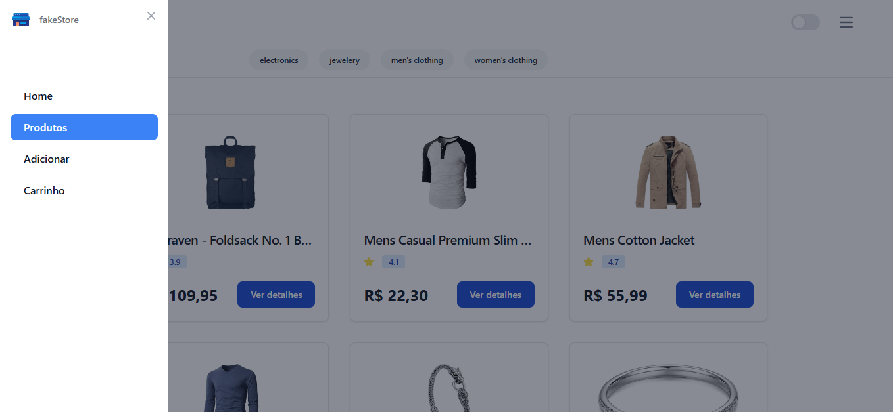
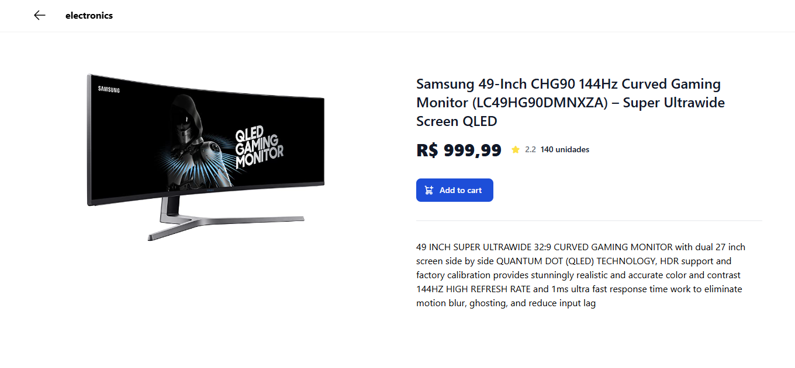
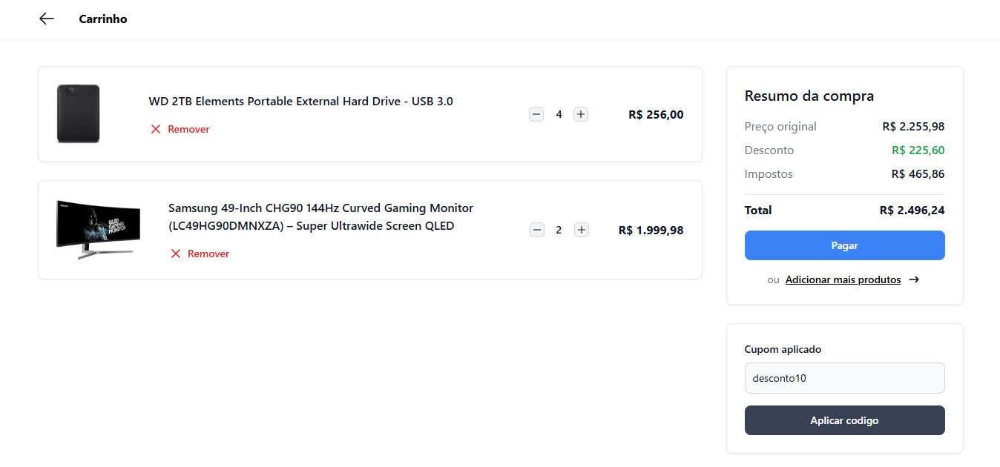
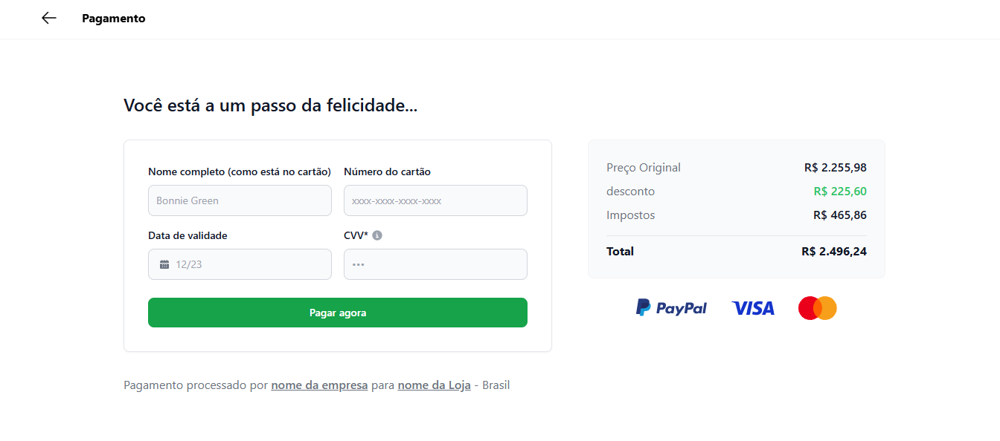

# Components with Vanilla JS

### Introduction

This project is based on componentization without using any bundles such as Webpack or Vite, the fakestore API was used, which you can check by clicking the button below.

I created this project with the aim of showing that it is possible to create a website and use components to build the application without a framework.

### Demo
[Click here to see website in production](https://componentizacao.netlify.app/)

### Images
 

#### Products

#### Products Details

#### Cart

#### Payment

## :bar_chart: Technologies

- [Tailwindcss](https://tailwindcss.com/)
A utility-first CSS framework packed with classes like flex, pt-4, text-center and rotate-90 that can be composed to build any design, directly in your markup.
 

- [Flowbite](https://flowbite.com/dochttps://flowbite.com/docs/getting-started/introduction/)
        Get started with the most popular open-source library of interactive UI components built with the utility classes from Tailwind CSS
         

## :computer: Installation

#### Step 1 - Download this project

  ##### Option :one: - Download Zip 
  ##### Option :two: - Cloning a repository - [how to do this](https://docs.github.com/en/repositories/creating-and-managing-repositories/cloning-a-repository). 

  #### Step 2 - Run index.html file

 

Made with :heart: by Jabes Enock